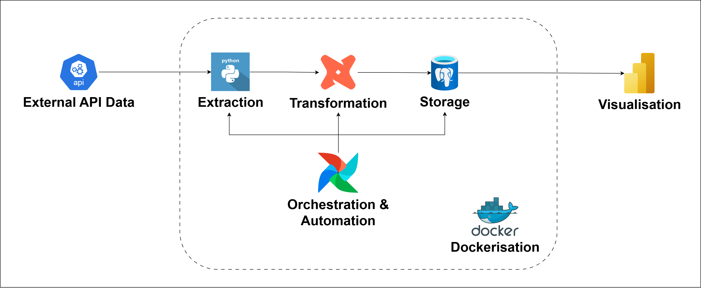
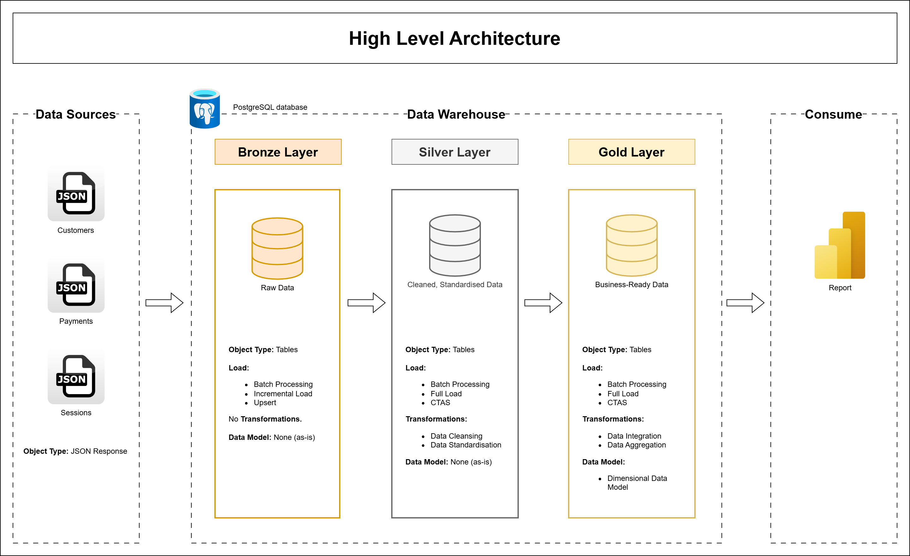

# Website Analytics Data Pipeline Project

This project builds an end-to-end data pipeline using **Python, PostgreSQL, dbt, Apache Airflow**, following the **Medallion Architecture**. The system processes raw ecommerce data (customers, payments, sessions) from an API into structured, analytics-ready datasets.

---

## Project Overview
This project involves:
- **Data Architecture**: Designing a modern data warehouse using the **Medallion Architecture** (Bronze, Silver, Gold) to ensure data quality and scalability.

- **Data Ingestion & Transformation**: Data is ingested from APIs into the Bronze layer and transformed using **dbt**, orchestrated by **Apache Airflow**.

- **Data Modeling**: Implementation of a **Star Schema** in the Gold layer with fact and dimension tables optimized for analytics and BI tools.

---

## System Architecture



Each component has a clear responsibility:
- **Docker**: Container runtime and packaging layer providing consistent environments for all services (PostgreSQL, Airflow, dbt, and API).
- **PostgreSQL**: Central database used across all pipeline stages (Bronze, Silver, Gold).
- **Mock API**: Provides sample ecommerce data for ingestion.
- **dbt**: Runs transformations inside a dedicated container, with the project mounted at `/usr/app`.
- **Apache Airflow**: Orchestrates the pipeline, including data extraction and dbt transformations.

---

## Data Architecture



This project follows the **Medallion Architecture**:

### Bronze Layer
- Raw data ingestion from API
- Stores unprocessed data

### Silver Layer
- Data cleaning and standardization
- Type casting and validation

### Gold Layer
- Dimensional Data Model (Business Transformation)
- Ready for BI and analysis

---

## How to Run

Start all core services:

```bash
docker compose up -d --build
```

---

## Pipeline Flow
The pipeline follows an ELT workflow:
1. **Extract**
   - Airflow triggers Python scripts to call external APIs
   - Data is retrieved incrementally
2. **Load (Bronze Layer)**
   - Raw data is loaded into PostgreSQL without modification
3. **Transform (Silver Layer)**
   - dbt cleans and standardizes data:
     - Handle missing values
     - Cast data types
     - Apply basic validation
4. **Transform (Gold Layer)**
   - dbt builds business models:
     - Fact tables (payments, sessions)
     - Dimension tables (customers)
   - Data is structured into a Star Schema
5. **Serve**
   - Power BI queries the Gold layer
   - Dashboards and reports are generated
6. **Orchestration**
   - Airflow schedules and runs the full pipeline daily.

---

## Technologies Used
- Python
- Data build tool (dbt)
- Apache Airflow
- PostgreSQL
- Power BI
- Docker